<p align="center">
  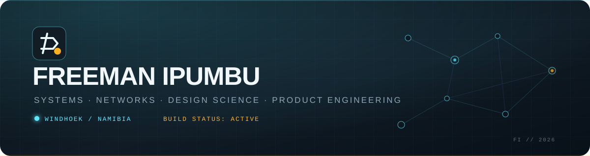
</p>

<p align="center">
  <a href="https://freeman-ipumbu.pages.dev/"></a>
  <a href="https://www.linkedin.com/in/freeman-paul-ipumbu/"></a>
  <a href="mailto:freeman.ipumbu@outlook.com"></a>
</p>

## I engineer systems people can trust.

I work where **infrastructure, human behaviour and product design** meet. I keep critical systems alive, turn messy operational problems into evidence-led artefacts, and ship digital products built to survive real-world use.

Based in **Windhoek, Namibia**, with more than a decade across network operations, offshore IT, enterprise systems and technical support. My current work extends that foundation into design science research and end-to-end product engineering.

```text
OBSERVE → FRAME → DESIGN → BUILD → EVALUATE → HARDEN → SHIP
```

### Current signal

- **Senior IT Systems Administrator** — The Free Press of Namibia / The Namibian / Namibia Media Trust
- **Product builder** — products spanning trusted mobility, the Runnerz social-running ecosystem and its official local-first music player, aviation coordination and public-interest command systems
- **Published design science researcher** — IT handover continuity, with an open DOI-backed research record
- **Builder within SolarSpin Technologies** — creating practical Namibian digital products with operational depth
- **Football archive builder** — creating KICKOFF NAM, a source-linked Namibian football intelligence archive spanning 103 player profiles, 28 club-directory entries and all 14 regional associations
- **Community digital steward** — helping grassroots initiatives like Magic Boys Football Academy earn visibility without trading away young people’s privacy
- **Local-enterprise storyteller** — translating businesses like Ontoko Foods into credible, distinctly Namibian digital experiences
- **Public-interest systems builder** — separating E.M.A. Namibia’s nonprofit mission from OSH-Med International’s academy, then taking E.M.A. into an authenticated emergency-control and responder pilot with its own nonprofit-owned alarm engine and open operational map
- **Namibia-first farm systems builder** — shipping Omutambo as an invitation-only, multi-species livestock and poultry operations workspace with evidence-led measures, private workspaces and a 100-check release gate

## Start here

| What you want to inspect | Best entry point |
|---|---|
| Shipped products and working demos | **[Interactive portfolio](https://freeman-ipumbu.pages.dev/)** |
| Research method and published evidence | **[IT Handover Continuance](https://doi.org/10.5281/zenodo.21840440)** |
| Product decisions without exposing private production code | **[Public case-study repositories](https://github.com/freeman-ipumbu?tab=repositories)** |
| Namibian football data and its original sources | **[KICKOFF NAM](https://kickoff-nam.pages.dev/)** |
| A direct conversation | **[LinkedIn](https://www.linkedin.com/in/freeman-paul-ipumbu/)** or **[email](mailto:freeman.ipumbu@outlook.com)** |

## Current flagship — one Runnerz ecosystem

<p align="center">
  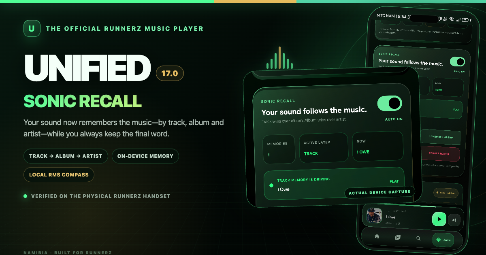
</p>

<table>
  <tr>
    <td width="50%">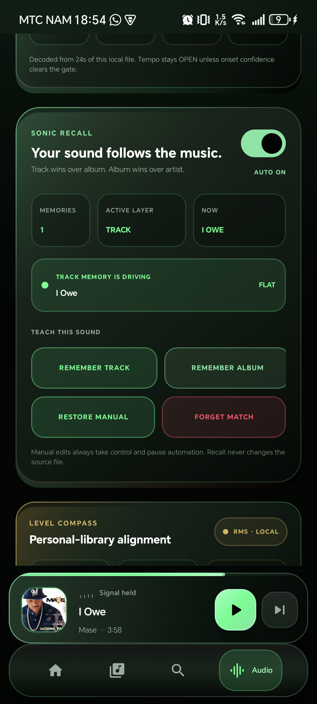</td>
    <td width="50%">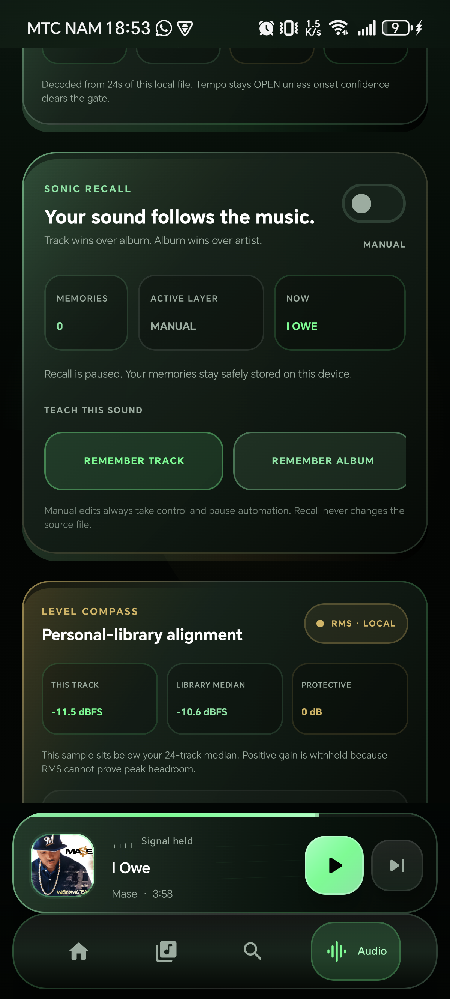</td>
  </tr>
</table>

<p align="center"><sub>UNIFIED 17.0 Sonic Recall · real device UI · Android 15 · 3,795-track local library</sub></p>

**UNIFIED × Runnerz** is the official music layer for Runnerz: a local-first Kotlin Multiplatform player with a protected Library Vault, Flow State, Sonic Atlas, measured local Soundprints, seven movement intents, Pace Map, private Pace Brain guidance, Afterglow, Signal Journal, Momentum Engine, Session Studio, Track Radio and thirty-five persistent badges. Starting a session begins playback in UNIFIED and sends only bounded session context to Runnerz—never track identities or the listener’s full history.

UNIFIED 17.0 adds **Sonic Recall**: opt-in complete sound memories scoped to a track, album or artist, deterministic specificity, a visible active layer, instant manual takeover and a personal-library **Level Compass** built from real cached sample-RMS Soundprints. It deliberately withholds unsupported positive gain and never labels RMS as LUFS. The release is verified across 71 shared tests, Android lint with zero errors, debug/release assembly, shared iOS compilation and an in-place Android 15 installation. The original install identity, exact Vault checksum and all 3,795 tracks were retained; a track rule survived a cold restart before being cleanly removed. Apple Music and Spotify production adapters remain explicit credentialled integration gates.

**[Inspect the public engineering case study ↗](https://github.com/freeman-ipumbu/unified-music-case-study)** · **[See it inside Runnerz ↗](https://runnerznamibia.com/#official-music-player)**

## Selected proof of work

<table>
  <tr>
    <td colspan="2" valign="top">
      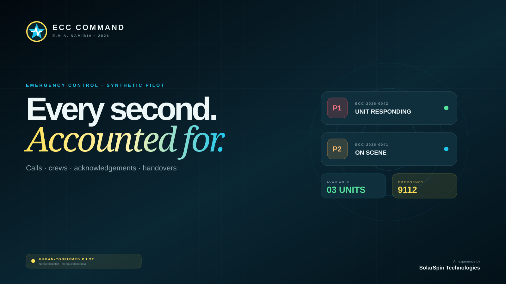
      <h3>ECC Command · E.M.A. Namibia</h3>
      <p>An authenticated emergency-control and responder PWA joining workbook-aligned intake, human-confirmed priority and location, unit statuses 0–9, a source-labelled open operational map, guided operator onboarding and attributable handover with ECC Signal—an E.M.A.-owned alarm engine carrying all 139 inherited quick-action references without putting a paid provider on the critical path.</p>
      <p><b>Role:</b> field discovery, legacy workflow archaeology, emergency workflow modelling, product strategy, safety boundary, identity and interaction design, full-stack engineering, access control, Cloudflare Pages Functions and D1, mobile hardening and deployment.</p>
      <p><a href="https://ecc-command.pages.dev/"><b>Protected pilot ↗</b></a> · <a href="https://github.com/freeman-ipumbu/ecc-command-case-study">Public case study ↗</a></p>
    </td>
  </tr>
  <tr>
    <td colspan="2" valign="top">
      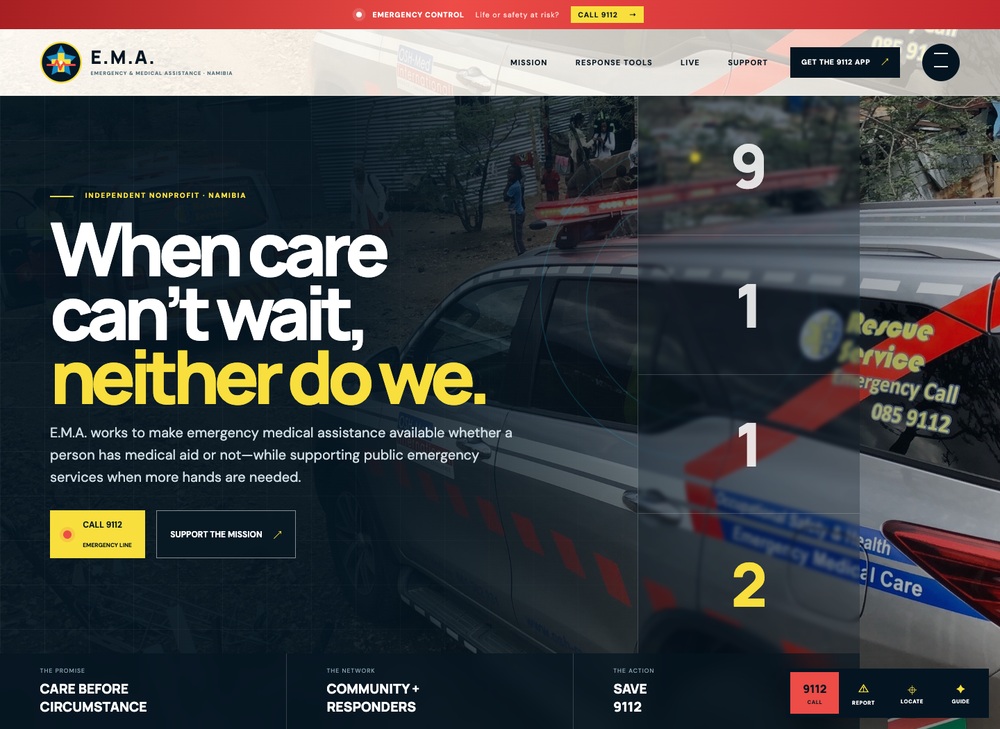
      <h3>E.M.A. Namibia — Care Before Circumstance</h3>
      <p>An emergency-first digital command surface for an independent Namibian nonprofit: persistent 9112 access, guided response tools, privacy-conscious location and report flows, Kosmos 94.1 radio, resilient video pathways, supporter action and a new community-beacon identity.</p>
      <p><b>Role:</b> organisation research, product separation, identity redesign, emergency UX strategy, information architecture, interaction design, frontend engineering, mobile hardening, accessibility and Cloudflare launch.</p>
      <p><a href="https://ema-namibia.pages.dev/"><b>Live experience ↗</b></a> · <a href="https://github.com/freeman-ipumbu/ema-namibia-case-study">Public case study ↗</a></p>
    </td>
  </tr>
  <tr>
    <td colspan="2" valign="top">
      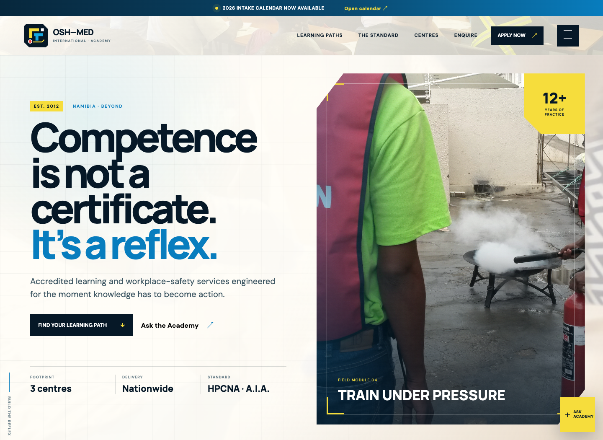
      <h3>OSH-Med International — Competence as a Reflex</h3>
      <p>A distinct professional academy for accredited emergency-care, first-aid, occupational-safety and high-risk-work learning, with an interactive pathway finder, accreditation context, national training footprint and a new reflex-system identity.</p>
      <p><b>Role:</b> organisation research, service architecture, identity redesign, learning-path UX, art direction, interaction design, frontend engineering, mobile hardening, accessibility and Cloudflare launch.</p>
      <p><a href="https://osh-med-international.pages.dev/"><b>Live academy ↗</b></a> · <a href="https://github.com/freeman-ipumbu/osh-med-international-case-study">Public case study ↗</a></p>
    </td>
  </tr>
  <tr>
    <td colspan="2" valign="top">
      
      <h3>Ontoko Foods</h3>
      <p>A premium, founder-led digital home for Jane Auala’s growing agricultural business—bringing Ontoko’s real identity, editorial product imagery, farm archive and food-security purpose together in one unmistakably Namibian experience.</p>
      <p><b>Role:</b> public-source research, story architecture, brand translation, product art direction, UX/UI, frontend engineering, interaction design, mobile hardening, accessibility and Cloudflare launch.</p>
      <p><a href="https://ontoko-foods.pages.dev/"><b>Live website ↗</b></a> · <a href="https://github.com/freeman-ipumbu/ontoko-foods-case-study">Public case study ↗</a></p>
    </td>
  </tr>
  <tr>
    <td colspan="2" valign="top">
      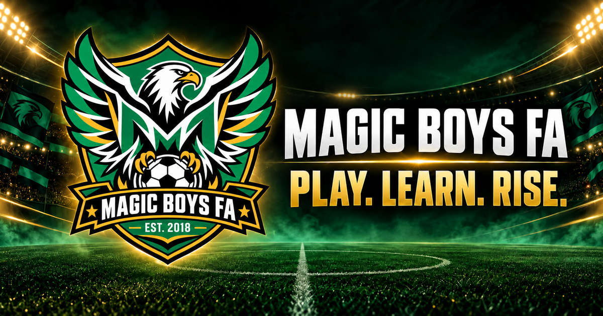
      <h3>Magic Boys Football Academy</h3>
      <p>A joyful, mobile-first identity and public home for a Namibian community football academy founded to keep young people active, disciplined and connected to something positive.</p>
      <p><b>Role:</b> discovery, brand direction, identity design, UX/UI, frontend engineering, accessibility, safeguarding boundary and Cloudflare launch.</p>
      <p><a href="https://magicboys.pages.dev/"><b>Live website ↗</b></a> · <a href="https://github.com/freeman-ipumbu/magic-boys-fc-case-study">Public case study ↗</a></p>
    </td>
  </tr>
  <tr>
    <td colspan="2" valign="top">
      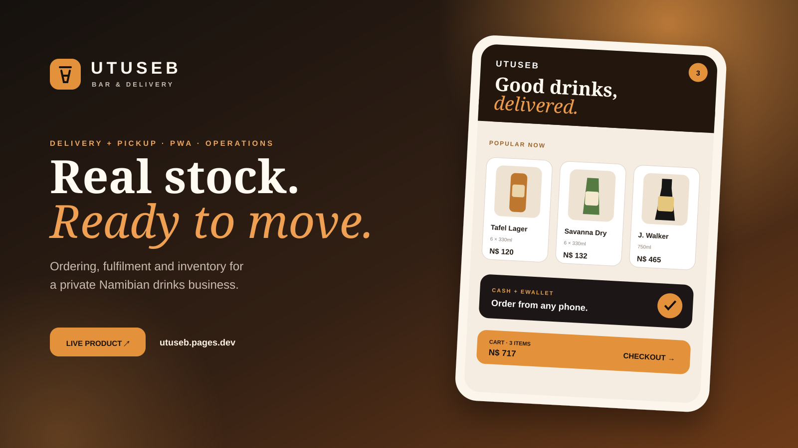
      <h3>Utuseb — Drinks &amp; Delivery</h3>
      <p>A mobile commerce and operations platform for a private Namibian drinks business: delivery or arranged pickup, 47 product-specific catalogue lines, universal 18+ ID verification, cash/eWallet checkout, installable PWA, live fulfilment, inventory and downloadable sales/stock reports.</p>
      <p><b>Role:</b> product strategy, UX/UI, product photography system, full-stack engineering, PWA performance, security hardening, Cloudflare D1 and launch.</p>
      <p><a href="https://utuseb.pages.dev"><b>Live product ↗</b></a> · <a href="https://github.com/freeman-ipumbu/utuseb-case-study">Public case study ↗</a></p>
    </td>
  </tr>
  <tr>
    <td width="50%" valign="top">
      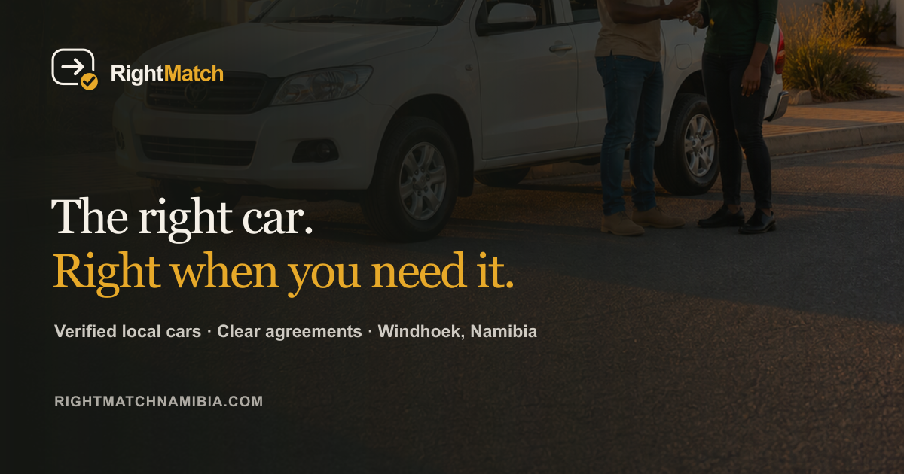
      <h3>RightMatch Namibia</h3>
      <p>A trust-first peer-to-peer vehicle marketplace designed for Namibia. Verification, explicit terms and a durable deal trail bring more structure to owner–renter transactions.</p>
      <p><b>Role:</b> product strategy, design research, UX/UI, brand refinement, full-stack engineering, trust architecture, infrastructure and launch.</p>
      <p><a href="https://rightmatchnamibia.com"><b>Live product ↗</b></a> · <a href="https://github.com/freeman-ipumbu/rightmatch-namibia-case-study">Public case study ↗</a></p>
    </td>
    <td width="50%" valign="top">
      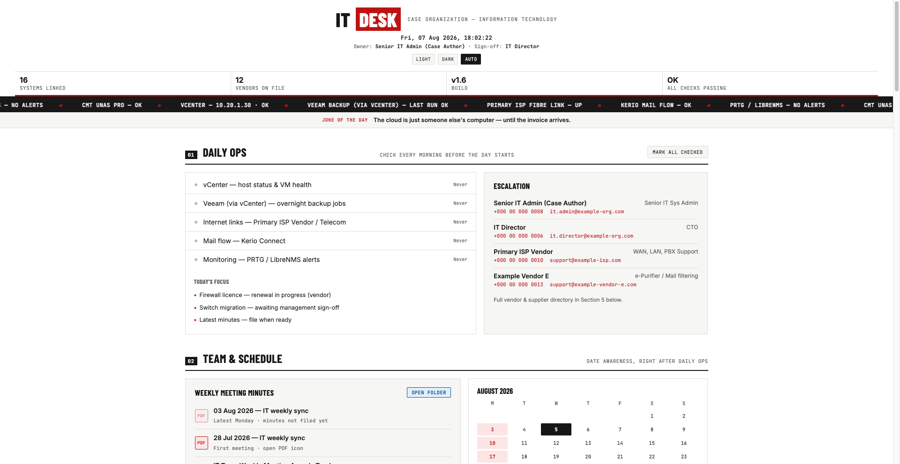
      <h3>IT Handover Continuance</h3>
      <p>A design science research project that treats institutional knowledge continuity as a living system—not a document someone files and forgets.</p>
      <p><b>Role:</b> researcher, artefact designer and author.</p>
      <p><a href="https://github.com/freeman-ipumbu/it-handover-continuance-dsr"><b>Repository ↗</b></a> · <a href="https://doi.org/10.5281/zenodo.21840440">Published record ↗</a></p>
    </td>
  </tr>
  <tr>
    <td width="50%" valign="top">
      
      <h3>Dream High Learning Institute</h3>
      <p>A research-led digital identity and responsive institutional experience unifying early learning, school support, vocational training and counselling.</p>
      <p><b>Role:</b> design research, strategy, visual direction, frontend engineering, content systems and deployment.</p>
      <p><a href="https://dream-high-learning.pages.dev/"><b>Live website ↗</b></a> · <a href="https://github.com/freeman-ipumbu/dream-high-learning-case-study">Public case study ↗</a></p>
    </td>
    <td width="50%" valign="top">
      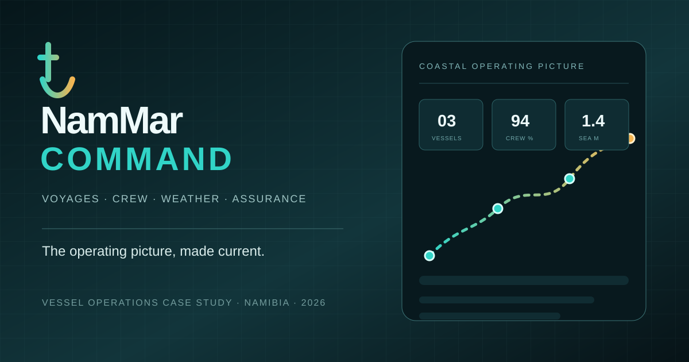
      <h3>NamMar Command</h3>
      <p>A vessel-operations command centre unifying voyages, crew readiness, live coastal conditions, public vessel status and departure assurance.</p>
      <p><b>Role:</b> product strategy, systems design, command UX, React engineering and marine-operational research.</p>
      <p><a href="https://github.com/freeman-ipumbu/nammar-command-case-study"><b>Public case study ↗</b></a></p>
    </td>
  </tr>
  <tr>
    <td colspan="2" valign="top">
      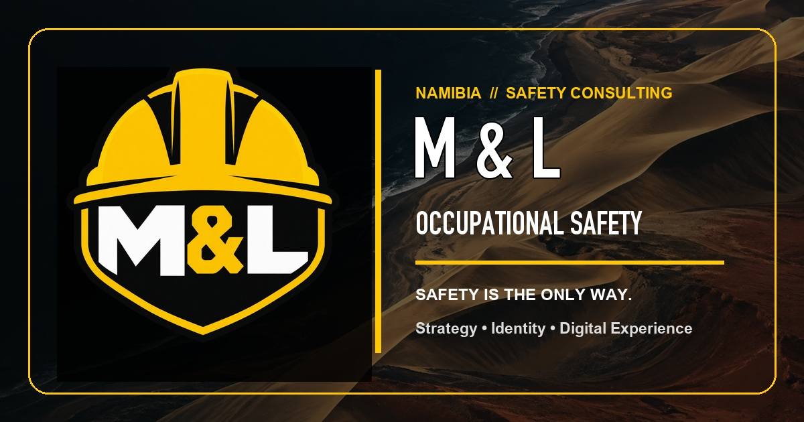
      <h3>M &amp; L Occupational Safety</h3>
      <p>A bold, mobile-hardened business website for a Windhoek occupational health and safety consultancy—turning a dense working overview into a clear service story with a refined industrial identity and a distinctly Namibian sense of place.</p>
      <p><b>Role:</b> business positioning, identity refinement, UX/UI, content architecture, frontend engineering, mobile hardening, performance and Cloudflare Pages deployment.</p>
      <p><a href="https://ml-occupational-safety.pages.dev"><b>Live website ↗</b></a> · <a href="https://github.com/freeman-ipumbu/ml-occupational-safety-case-study">Public case study ↗</a></p>
    </td>
  </tr>
  <tr>
    <td width="50%" valign="top">
      
      <h3>Borizago — Boriza Shuttle & Tours</h3>
      <p>An installable transport platform connecting seven Namibian towns through live capacity and server-priced scheduled-shuttle bookings, with guided enquiry paths for tour, airport, private-transfer and parcel services, downloadable travel guides, operations alerts and direct customer confirmations.</p>
      <p><b>Role:</b> product strategy, UX/UI, full-stack engineering, booking integrity, operations workflow, mobile hardening, Cloudflare deployment and launch.</p>
      <p><a href="https://borizashuttles.pages.dev/"><b>Live app ↗</b></a> · <a href="https://github.com/freeman-ipumbu/borizago-case-study">Public case study ↗</a></p>
    </td>
    <td width="50%" valign="top">
      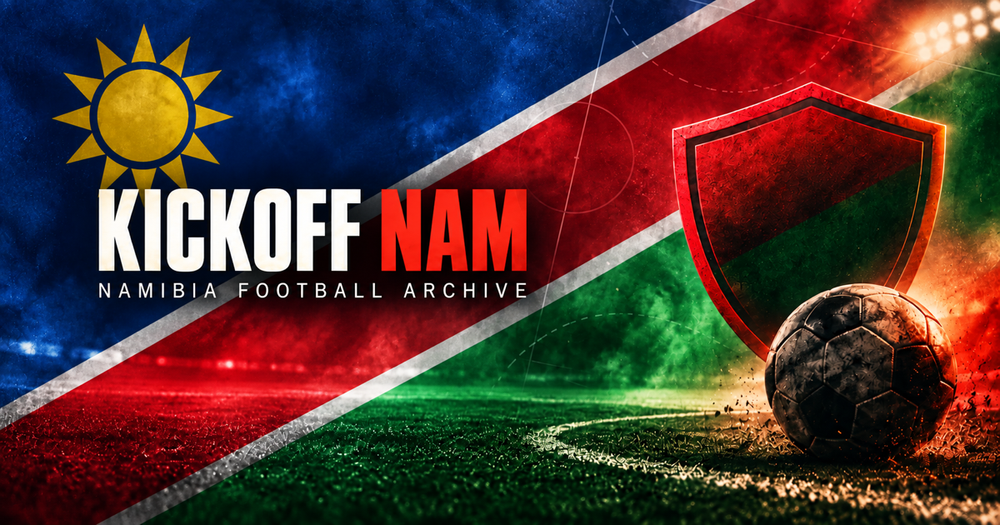
      <h3>KICKOFF NAM</h3>
      <p>A public, source-linked Namibian football archive connecting 103 player profiles, 28 club-directory entries, all 14 regional associations, competition pathways and attributed historical context. Coverage limits and source dates stay visible instead of being presented as live registration data.</p>
      <p><b>Role:</b> product strategy, archival research, data modelling, UX/UI, full-stack engineering, security architecture and Cloudflare launch.</p>
      <p><a href="https://kickoff-nam.pages.dev/"><b>Live archive ↗</b></a> · <a href="https://github.com/freeman-ipumbu/kickoff-nam-case-study">Public case study ↗</a></p>
    </td>
  </tr>
</table>

<table>
  <tr>
    <td width="50%" valign="top">
      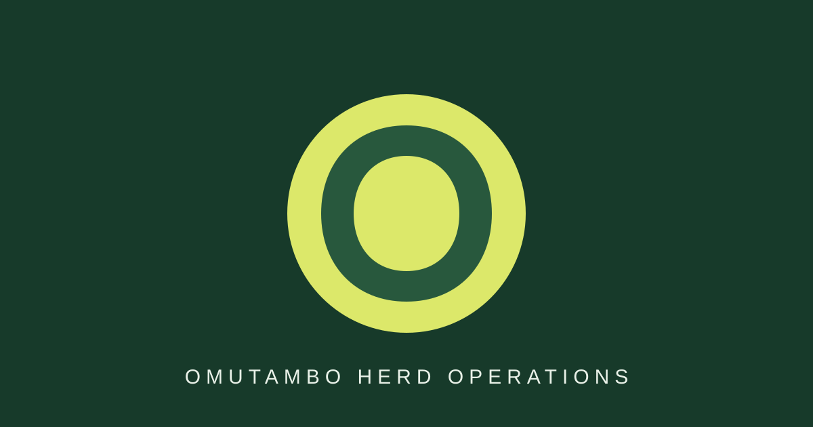
      <h3>Omutambo Herd Operations</h3>
      <p>A live, invitation-only farm-operations workspace joining cattle, goats, sheep, freely named livestock and flock-level poultry command with identity, housing, production, feed, mortality, health, camps, movements, tasks, NAD costs and field evidence. Its current release passes 100 automated checks and leaves the owner-authenticated production smoke check visibly open.</p>
      <p><b>Role:</b> product strategy, design science, brand system, information architecture, multi-species data modelling, poultry operations, full-stack engineering, offline-first UX, access controls, release verification and Cloudflare deployment.</p>
      <p><a href="https://omutambo.pages.dev"><b>Live product ↗</b></a> · <a href="https://github.com/freeman-ipumbu/omutambo-herd-case-study">Public case study ↗</a></p>
    </td>
    <td width="50%" valign="top">
      
      <h3>Runnerz Namibia</h3>
      <p>A route-driven social running network built in Windhoek around compatible pace, intent, place, timing and earned trust—not empty follower counts. Its ecosystem now includes UNIFIED as the official Runnerz music player, with an explicit privacy-light session handoff between playback and route tracking.</p>
      <p><b>Role:</b> founder, product strategy, design research, Android and web engineering, mapping, safety architecture, secure operations and infrastructure.</p>
      <p><a href="https://runnerznamibia.com"><b>Live product ↗</b></a> · <a href="https://github.com/freeman-ipumbu/runnerz-android-case-study">Android case study ↗</a> · <a href="https://github.com/freeman-ipumbu/runnerz-namibia-website-case-study">Web case study ↗</a></p>
    </td>
  </tr>
  <tr>
    <td width="50%" valign="top">
      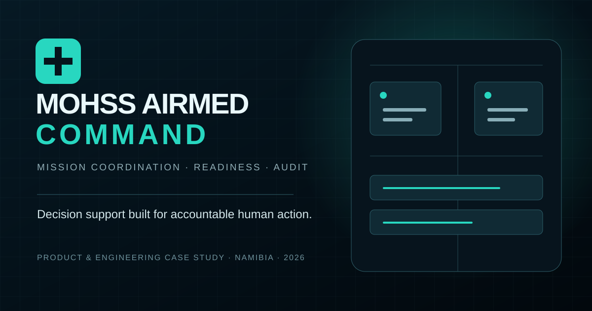
      <h3>MOHSS AIRMED COMMAND</h3>
      <p>A national air-medical coordination concept connecting mission intake, clinical and aviation readiness, authorization and attributable audit history.</p>
      <p><b>Role:</b> systems design, design research, command UX, React engineering and Kotlin/Spring backend foundation.</p>
      <p><a href="https://github.com/freeman-ipumbu/mohss-airmed-command-case-study"><b>Public case study ↗</b></a></p>
    </td>
    <td width="50%" valign="top">
      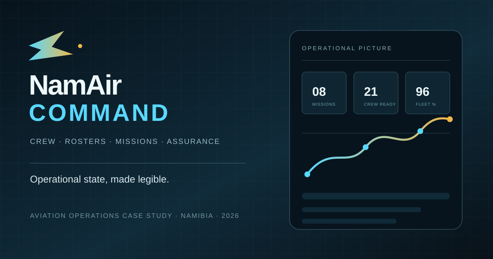
      <h3>NamAir Command</h3>
      <p>An aviation command, crew-readiness and rostering prototype that makes duty assumptions, readiness state, mission pressure and audit evidence legible.</p>
      <p><b>Role:</b> product design, systems engineering, interaction design and prototype development.</p>
      <p><a href="https://github.com/freeman-ipumbu/namair-command-case-study"><b>Public case study ↗</b></a></p>
    </td>
  </tr>
  <tr>
    <td width="50%" valign="top">
      
      <h3>Technical Portfolio</h3>
      <p>An interactive view of the systems, networking, security, research and product work behind the job titles.</p>
      <p><b>Signal:</b> ten years of field experience, documented and made inspectable.</p>
      <p><a href="https://freeman-ipumbu.pages.dev/"><b>Explore portfolio ↗</b></a> · <a href="https://github.com/freeman-ipumbu/freeman-ipumbu-portfolio">Repository ↗</a></p>
    </td>
    <td width="50%" valign="top">
      
      <h3>UNIFIED 17.0 — Sonic Recall</h3>
      <p>The official Runnerz music player: a local-first Kotlin Multiplatform system with a protected 3,795-track Library Vault, native playback, Flow State, Sonic Atlas, Pace Map, Pace Brain, Afterglow, adaptive daily missions, a 28-day Listening Season, playable Next Move, thirty-five persistent badges, ShowTime Radio, Sonic Forge and track/album/artist sound memory.</p>
      <p><b>Role:</b> product design, interaction system, Kotlin Multiplatform architecture, Android audio engineering and visual design.</p>
      <p><a href="https://github.com/freeman-ipumbu/unified-music-case-study"><b>Public case study ↗</b></a> · <a href="https://runnerznamibia.com/#official-music-player">Runnerz feature ↗</a></p>
    </td>
  </tr>
</table>

## Engineering lens

| Reliability | Security | Design science | Product engineering |
|---|---|---|---|
| Networks, systems, service continuity, observability and documentation | Firewalls, access boundaries, evidence, governance and operational risk | Problem framing, artefact design, demonstration, evaluation and iteration | Research, UX, frontend, backend, infrastructure, launch and lifecycle thinking |

## Working stack


> **My standard:** simple enough to understand, strong enough to trust, and documented well enough to survive the person who built it.

AI is part of the toolchain. Judgment, accountability and final ownership remain human.

## Open channel

I am open to conversations around resilient infrastructure, systems administration, network security, research collaboration and ambitious product work—especially ideas capable of creating practical value in Namibia.

**[Portfolio](https://freeman-ipumbu.pages.dev/)** · **[LinkedIn](https://www.linkedin.com/in/freeman-paul-ipumbu/)** · **[Research](https://doi.org/10.5281/zenodo.21840440)** · **[Email](mailto:freeman.ipumbu@outlook.com)**

<sub>Built from Windhoek. Tested against reality.</sub>
